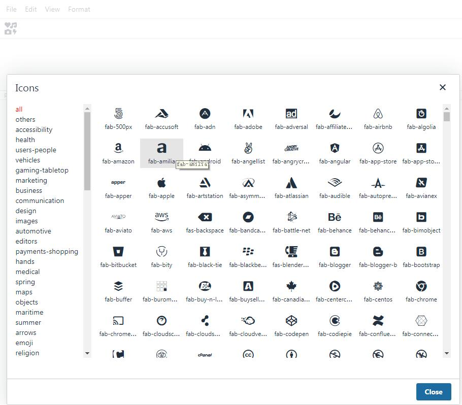

# tinymce-fontawesomepicker
A plugin for `tinymce v5` that selects the `fontawesome` icon.

[example](http://gitpages.wo2.me/tinymce-fontawesomepicker/)


# usage
- Move the `fontawesomepicker` folder to `tinymce/plugins`
    ```js
    window.tinymce.init({
        selector: 'textarea',
        plugins: 'fontawesomepicker',
        toolbar: 'fontawesomepicker',
        fontawesomeUrl: 'https://www.unpkg.com/@fortawesome/fontawesome-free@5.13.0/css/all.min.css'
    })
    ```

- url `fontawesomepicker`
    ```js
    window.tinymce.init({
        selector: 'textarea',
        plugins: 'fontawesomepicker',
        toolbar: 'fontawesomepicker',
        fontawesomeUrl: 'https://www.unpkg.com/@fortawesome/fontawesome-free@5.13.0/css/all.min.css',
        external_plugins: {
            //  url
            fontawesomepicker: 'https://www.unpkg.com/tinymce-fontawesomepicker/fontawesomepicker/plugin.js'
        },
    })
    ```

- npm
    ```bash
    npm i -S tinymce-fontawesomepicker
    ```


# fontawesome v5.13.0
当前插件使用的fontawesome版本为`5.13.0`，建议你也使用此版本。
若使用其他版本可能会导致选择窗口展示的图标和实际图标对不上，这是因为当前插件会加载一个`fontawesome 5.13.0`版本的[图标分类文件](fontawesomepicker/asset/categories.json)。

如需使用其他版本，可参见目录`build/package.json`。
1. 修改`@fortawesome/fontawesome-free`的版本号
2. `npm i`下载
3. `node index`重新生成一份对应版本的分类文件(categories.json)


# 兼容
由于代码中用到了`fetch`，因此不兼容Internet Explorer浏览器。


# 展示 [example](http://gitpages.wo2.me/tinymce-fontawesomepicker/)


# 说明
目前存在一些问题，我没有好的解决方案。
1. 图标不能像字体一样被选中
2. 生成的图标代码过多，由于tinymce限制，无法添加空标签 例子:`<span class="fa fa-xxx"></span>`，所以我将它做成了如下，利用不显示的`<!-- . -->`来占位。
    ```html
    <span>
        <!-- . -->
        <span class="fa fa-xxx"></span>
    </span>
    ```
